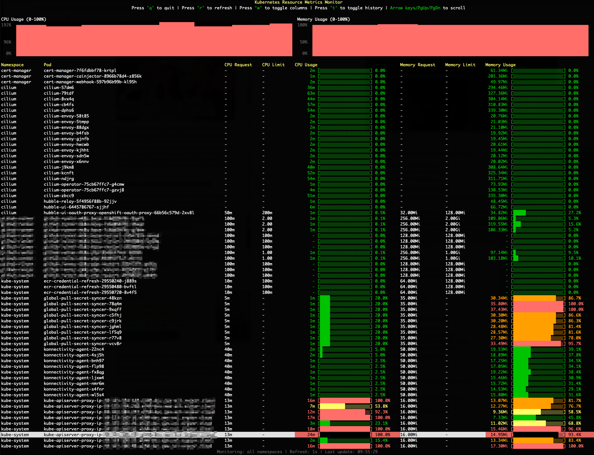

# kubectl-topx

A Kubernetes CLI tool for monitoring CPU and memory resources (requests, limits, and actual usage) in real-time.



## Features

- Shows CPU and memory requests, limits, and current usage
- Live updates
- Progress bars for visual representation
- Color-coded output based on usage level
- Historical metrics with visual histograms

#### Comparison `kubectl topx` and `kubectl ktop`:

While both tools provide a terminal-based (TUI) interface for Kubernetes observability, they serve different operational needs:

- **ktop** is a comprehensive **cluster dashboard**. It provides a broad, full-stack view of the cluster, managing visualizations for Nodes, cluster-level summaries, and general component health. It acts as a general-purpose monitor for the entire infrastructure ecosystem relying on Prometheus data.
https://github.com/vladimirvivien/ktop 
- **topx** is a focused **usage profiler**. It narrows its scope exclusively to Pod metrics to reduce interaction friction. Unlike ktop's broad management suite, topx is designed for the specific task of rapid troubleshooting—helping developers instantly answer *"Which specific pods are consuming the most CPU or Memory right now?"* without navigating through node hierarchies.

## Prerequisites

- Access to a Kubernetes cluster (kubeconfig)
- [Metrics Server](https://github.com/kubernetes-sigs/metrics-server) must be installed in the cluster

## Installation

### Download from Release Page

1. Go to the [Releases page](https://github.com/mms-gianni/kubectl-topx/releases)
2. Download the latest release for your platform:
   - **Linux**: `kubectl-topx-linux-amd64`
   - **macOS (Intel)**: `kubectl-topx-darwin-amd64`
   - **macOS (Apple Silicon)**: `kubectl-topx-darwin-arm64`
   - **Windows**: `kubectl-topx-windows-amd64.exe`

3. Make the binary executable (Linux/macOS):
```bash
chmod +x kubectl-topx-*
```

4. Move to a directory in your PATH (optional but recommended):
```bash
# Linux/macOS
sudo mv kubectl-topx-* /usr/local/bin/kubectl-topx

# Or for user-only installation
mv kubectl-topx-* ~/.local/bin/kubectl-topx
```

5. Verify the installation:
```bash
kubectl topx --help
```

## Usage

```bash
# Start metrics monitoring (all namespaces)
kubectl topx

# Monitor only a specific namespace
kubectl topx --namespace kube-system
kubectl topx -n kube-system

## Monitor all namespaces
kubectl topx --all-namespaces
kubectl topx -A

# Show additional columns (requests/limits)
kubectl topx --wide
kubectl topx -w

# Enable historical metrics histogram
kubectl topx --history
kubectl topx -t

# Adjust refresh interval (e.g., 10 seconds)
kubectl topx --refresh 10
kubectl topx -r 10

# Combination
kubectl topx --namespace default --refresh 3 --wide --history
kubectl topx -n default -r 3 -w -t

# Show help
kubectl topx --help

# Exit with 'q' or ESC
# Manual refresh with 'r'
```

### Command-line Flags

- `--all-namespaces, -A` : Monitor all namespaces
- `--namespace, -n` : Kubernetes namespace to monitor (empty = all namespaces)
- `--refresh, -r` : Refresh interval in seconds (default: 5)
- `--wide, -w` : Show additional columns (e.g., Memory & CPU Requests/Limits)
- `--history, -t` : Show historical metrics histogram (default: off)
- `--help, -h` : Show help message

### Keyboard Shortcuts

- `q` or `ESC` : Exit
- `r` : Manual refresh
- `w` : Toggle wide mode (show/hide requests and limits)
- `t` : Toggle historical metrics histogram
- `Arrow keys`, `PgUp`, `PgDn` : Navigate through pods

## Display

The tool shows the following information for each pod:

- **Namespace**: The pod's namespace (shown when monitoring all namespaces)
- **Pod**: The pod name
- **CPU Request**: Requested CPU resources (wide mode only)
- **CPU Limit**: CPU limit (wide mode only)
- **CPU Usage**: Current CPU usage with progress bar
- **Memory Request**: Requested memory resources (wide mode only)
- **Memory Limit**: Memory limit (wide mode only)
- **Memory Usage**: Current memory usage with progress bar

### Color Coding

- 🟢 Green: < 50% usage
- 🟡 Yellow: 50-75% usage
- 🟠 Orange: 75-90% usage
- 🔴 Red: >= 90% usage

