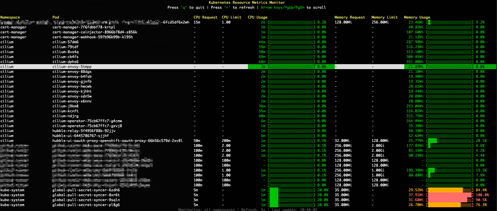

# kubectl-topx

A Kubernetes CLI tool for monitoring CPU and memory resources (requests, limits, and actual usage) in real-time.



## Features

- ✅ Shows CPU and memory requests, limits, and current usage
- ✅ Live updates
- ✅ Progress bars for visual representation
- ✅ Color-coded output based on usage level

## Prerequisites

- Access to a Kubernetes cluster (kubeconfig)
- Metrics Server must be installed in the cluster

## Installation

### Download from Release Page

1. Go to the [Releases page](https://github.com/YOUR_USERNAME/kubectl-topx/releases)
2. Download the latest release for your platform:
   - **Linux**: `kubectl-topx-linux-amd64`
   - **macOS (Intel)**: `kubectl-topx-darwin-amd64`
   - **macOS (Apple Silicon)**: `kubectl-topx-darwin-arm64`
   - **Windows**: `kubectl-topx-windows-amd64.exe`

3. Make the binary executable (Linux/macOS):
```bash
chmod +x kubectl-topx-*
```

4. Move to a directory in your PATH (optional but recommended):
```bash
# Linux/macOS
sudo mv kubectl-topx-* /usr/local/bin/kubectl-topx

# Or for user-only installation
mv kubectl-topx-* ~/.local/bin/kubectl-topx
```

5. Verify the installation:
```bash
kubectl topx --help
```

## Usage

```bash
# Start metrics monitoring (all namespaces)
kubectl topx

# Monitor only a specific namespace
kubectl topx --namespace kube-system
kubectl topx -n kube-system

# Adjust refresh interval (e.g., 10 seconds)
kubectl topx --refresh 10
kubectl topx -r 10

# Combination
kubectl topx --namespace default --refresh 3
kubectl topx -n default -r 3

# Show help
kubectl topx --help

# Exit with 'q' or ESC
# Manual refresh with 'r'
```

### Command-line Flags

- `--namespace, -n` : Kubernetes namespace to monitor (empty = all namespaces)
- `--refresh, -r` : Refresh interval in seconds (default: 5)
- `--help, -h` : Show help message

### Keyboard Shortcuts

- `q` or `ESC` : Exit
- `r` : Manual refresh

## Display

The tool shows the following information for each pod:

- **Namespace**: The pod's namespace
- **Pod**: The pod name
- **CPU Request**: Requested CPU resources
- **CPU Limit**: CPU limit
- **CPU Usage**: Current CPU usage with progress bar
- **Memory Request**: Requested memory resources
- **Memory Limit**: Memory limit
- **Memory Usage**: Current memory usage with progress bar

### Color Coding

- 🟢 Green: < 50% usage
- 🟡 Yellow: 50-75% usage
- 🟠 Orange: 75-90% usage
- 🔴 Red: >= 90% usage

## Architecture

The project uses:

- **cobra**: Command-line interface framework
- **tview**: Terminal UI Framework
- **client-go**: Kubernetes Go Client
- **metrics-client**: Kubernetes Metrics API Client

## Development

```bash
# Update modules
go mod tidy

# Run tests (if available)
go test ./...

# Format code
make fmt

# With Make
make help  # Shows all available targets
```

### Build

```bash
# Install dependencies
go mod download

# Build
go build -o kubectl-topx

# Or with Make
make build
```

## Troubleshooting

### "failed to get pod metrics"

This means that the Metrics Server is not installed or not available in your cluster.

**Solution:**
```bash
# Install Metrics Server
kubectl apply -f https://github.com/kubernetes-sigs/metrics-server/releases/latest/download/components.yaml

# Check if Metrics Server is running
kubectl get deployment metrics-server -n kube-system

# Test
kubectl top nodes
kubectl top pods
```

### "failed to load kubeconfig"

Make sure that your `~/.kube/config` file exists and is valid.

**Solution:**
```bash
# Check kubeconfig
kubectl config view

# Check context
kubectl config current-context

# Test connection
kubectl get nodes
```

### No Pods are Displayed

- Check if pods exist in the selected namespace
- Verify that you have the required RBAC permissions
- Try a different namespace with `--namespace kube-system` or `-n kube-system`

## Future Features

- [ ] Sorting by different columns
- [ ] Filtering by pod name (regex)
- [ ] Node-based view
- [ ] Historical data / graphs
